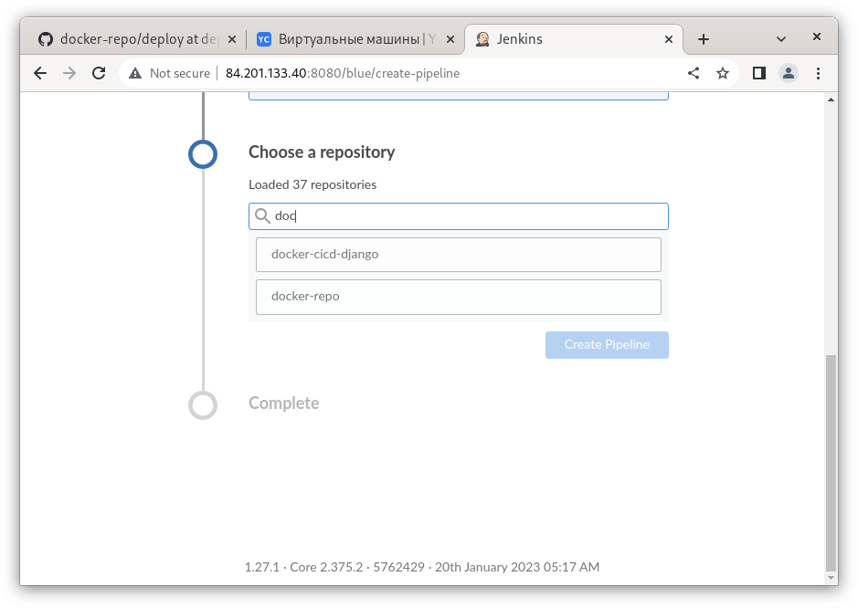

Пункт 1. приводится как справочный для настройки базовых 

<details>
    <summary>1. Готовим окружение для работы с YC</summary>
    <br>

1.1. Cоздаём сервисный аккаунт, предоставляем роль editor

```
$ yc iam service-account create --name neto-robot --description "Service account for Netology"
```
1.2. Создаём авторизованный ключ для вашего сервисного аккаунта и сохраняем его в файл, он понадобится нам в дальнейшем при развёртывании инфраструктуры:

```
$ yc iam key create --service-account-name neto-robot --output key.json
```

1.3. Создайте ключ доступа для сервисного аккаунта:

```
iva@c9:~/Documents/YC $ yc iam access-key create --service-account-name neto-robot
access_key:
  id: ajee50ng7jcav6p2c6oq
  service_account_id: ajegb4hm7vmc8mtflcdq
  created_at: "2022-03-25T23:39:13.295548648Z"
  key_id: YCAJEou5UEaZBnd8uIJte-gcn
secret: YCOX5m-V59haXjhUWAKTWxFDNjwn1nSdZmFAnh0B
```

1.4. Узнайте идентификатор сервисного аккаунта по его имени:

```
iva@c9:~/Documents/YC $ yc iam service-account get neto-robot
id: ajegb4hm7vmc8mtflcdq
folder_id: b1gm6im3mcuc36r6kn8s
created_at: "2022-03-25T22:28:10Z"
name: neto-robot
description: Service account for Netology
```
или из списка доступных

```
iva@c9:~/Documents/YC $ yc iam service-account list
+----------------------+------------+
|          ID          |    NAME    |
+----------------------+------------+
| ajegb4hm7vmc8mtflcdq | neto-robot |
+----------------------+------------+
```

1.5. Назначьте роль сервисному аккаунту neto-robot, используя его идентификатор:

```
yc resource-manager folder add-access-binding netology \
    --role editor \
    --subject serviceAccount:ajegb4hm7vmc8mtflcdq
```

Параметры командной строки

--access-key STR: Идентификатор ключа доступа

--secret-key STR: Секретный ключ доступа

1.6. Переменные окружения. Если какой-либо параметр аутентификации не указан в командной строке, YDB CLI пробует его получить из следующих переменных окружения:

AWS_ACCESS_KEY_ID: Идентификатор ключа доступа

AWS_SECRET_ACCESS_KEY: Секретный ключ доступа

-- добавляем параметры к нашему окружению:

```
export YC_TOKEN='AQAEA7**************'
export AWS_ACCESS_KEY_ID='YCAJEou5UE*****************'
export AWS_SECRET_ACCESS_KEY='YCOX5m-*************************'
```
-- так же можно внести эти параметры в .bashrc

</details>


<details>
    <summary>2. Создаём сервисный аккаунт для работы с YC в рамках проекта и bucket</summary>
    <br>

2.1. В директории репозитория [deploy/1.0](./1.0/) расположены скрипты terraform для создания сервисного аккаунта и bucket для хранения текущего состояния инфраструктуры.

Перед выполнением terraform необходимо внести изменения в terraform.tfvars, указав соответсвующие параметры YC и данные сервисного аккаунта созданного на "Шаге 1" либо имеющегося административного аккаунта.

```
$ cat terraform.tfvars 
yc_cloud_id              = "b1gos10ashr7cgusvgg9"
yc_folder_id             = "b1gm6im3mcuc36r6kn8s"
yc_zone                  = "ru-central1-a"
service_account_key_file = "../YC/tf_sa_key.json"
sa_name			 = "neto-fdevops-13"
bucket_tf		 = "neto-bucket-fdevops-13"

```

```
$ terraform plan
$ terraform apply -auto-approve
$ terraform output -json sa_json_key_terraform >../YC/sa_json_key_terraform.json
```

Результатом выполнения будет создание bucket S3, сервисного аккаунта с ролью editor, файла с данными сервисного аккаунта - понадобятся нам в дальнейшем и будут использованы на всём протяжении.

</details>

<details>
    <summary>3. Создаyние инфраструктуры в YC</summary>
    <br>

3.1. астраиваем workspace и выбираем в качестве рабочего "stage"

```
/1.1 $ terraform workspace list 
* default

/1.1 $ terraform workspace new stage
Created and switched to workspace "stage"!

You're now on a new, empty workspace. Workspaces isolate their state,
so if you run "terraform plan" Terraform will not see any existing state
for this configuration.

/1.1 $ terraform workspace list 
  default
* stage

/1.1 $ terraform workspace new prod
Created and switched to workspace "prod"!

You're now on a new, empty workspace. Workspaces isolate their state,
so if you run "terraform plan" Terraform will not see any existing state
for this configuration.

/1.1 $ terraform workspace list 
  default
* prod
  stage

/1.1 $ terraform workspace select stage
Switched to workspace "stage".
iva@c9v:~/Documents/Diplom/1.1 $ terraform workspace list 
  default
  prod
* stage


```

3.2 Создаём инфраструктуру "Stage"

Перед созданием необходимо внести соответсвующие правки в конфигурационный файл переменных terraform.tfvars -указать данные для сервисного аккаунта полученные на "шаге 2", и данные для будущей авторизации на хостах

```
$ cat metadata.txt
#cloud-config
users:
  - name: ansible
    groups: sudo
    shell: /bin/bash
    sudo: ['ALL=(ALL) NOPASSWD:ALL']
    ssh-authorized-keys:
      - ssh-rsa AAAAB3NzaC1yc2EAAAAD<cut></cut>
```

```
/1.1$ tree 

.
├── cicd_instance.tf - инстансы для Jenkins
├── generate_inventory.sh - генерация inventory для последующего использования в kubespray
├── k8s_deployer.tf	- инстанс для настройки kubernetes
├── k8s_instance.tf	- инстансы kubernetes
├── local.tf		- описание инстансов kubernetes через локальные переменные
├── main.tf		- основной модуль
├── network.tf		- описание создаваемых сетей через локальные переменнные
├── outputs.tf		- вывод результата создания инфраструктуры 
├── terraform.tfvars	- переменные terraform
├── variables.tf	- описание переменных terraform со значениями по умолчанию
└── versions.tf		- описание провайдера ЯО для terraform и хранения состояния в S3 bucket

0 directories, 11 files

```

```
/1.1 $ terraform plan - строим план, проверяем что получим в итоге

/1.1 $ terraform apply -auto-approve - применяем план

/1.1 $ terraform output - выводим данные инфраструктуры, они нам понадабятся при дальнейшем развёртывании. Включает в себя три ноды и контрол плэйн. а так же вспомогательные сервера для развёртывания деплоя и агентов teamcity
cicd_agent_nat_IP = [
  "84.201.129.17",
]
cicd_agents_IP = [
  "10.0.10.8",
]
cicd_master_IP = [
  "10.0.10.31",
]
cicd_master_nat_IP = [
  "84.201.173.5",
]
k8s_cp_IP = [
  "10.0.10.22",
]
k8s_cp_nat_IP = [
  "51.250.1.219",
]
k8s_deployer_IP = [
  "10.0.10.25",
]
k8s_deployer_nat_IP = [
  "51.250.92.86",
]
k8s_node_IP = [
  "10.0.10.11",
  "10.0.20.16",
  "10.0.30.30",
]
workspace = "stage"
```
</details>

<details>
    <summary>4. Разворачиваем кластер используя kubesray</summary>
    <br>

4.1. Разворачивать будем с отдельновыделенного хоста который в будущем не будет входить в кластер. 

подключаемся из-вне:

```
$ ssh ansible@51.250.92.86

```

После подключения необходимо установить необходимые для дальнейшей работы пакеты:

```
$ sudo apt-get update -y && sudo apt-get install git mc python3-pip -y
```

разместить в директории сертификат и закрытый ключ id_rsa, выставить соответсвующие права и проверить что работает подлкючение с удалённой машины на целевые хосты

```
cd .ssh/
chmod 600 id_rsa
ls -la
clear
cd
ssh ansible@10.0.10.22
ssh ansible@10.0.10.11
ssh ansible@10.0.20.16
ssh ansible@10.0.30.30
```

4.2. Клонируем репозиторий kubespray и производим настройку - выполняется на будущем controlplayn либо на deploer-хосте (в данном примере установка производилась с deployer)...

```
$ git clone https://github.com/kubernetes-sigs/kubespray
$ cd kubespray/
$ sudo pip3 install -r requirements.txt
$ cp -rfp inventory/sample inventory/mycluster
$ declare -a IPS=(10.0.10.22 10.0.10.11 10.0.20.16 10.0.30.30)
$ CONFIG_FILE=inventory/mycluster/hosts.yaml python3 contrib/inventory_builder/inventory.py ${IPS[@]}
$ cd inventory/mycluster/

ansible@deployer:~/kubespray/inventory/mycluster$ cat hosts.yaml
all:
  hosts:
    cp1:
      ansible_host: 10.0.10.22
      ip: 10.0.10.22
      access_ip: 10.0.10.22
    node1:
      ansible_host: 10.0.10.11
      ip: 10.0.10.11
      access_ip: 10.0.10.11
    node2:
      ansible_host: 10.0.20.16
      ip: 10.0.20.16
      access_ip: 10.0.20.16
    node3:
      ansible_host: 10.0.30.30
      ip: 10.0.30.30
      access_ip: 10.0.30.30
  children:
    kube_control_plane:
      hosts:
        cp1:
    kube_node:
      hosts:
        node1:
        node2:
        node3:
    etcd:
      hosts:
        cp1:
    k8s_cluster:
      children:
        kube_control_plane:
        kube_node:
    calico_rr:
      hosts: {}

```

Для доступа из-вне необходимо раскоментировать соответствующую настройку в файле k8s-cluster.yml.

```
ansible@deployer:~/kubespray/inventory/mycluster/group_vars/k8s_cluster$ cat k8s-cluster.yml | grep suppl
supplementary_addresses_in_ssl_keys: [51.250.1.219]
```
Так же необходимо перед развёртыванием раскоментировать/выставить соответсвующие плагины.

Пример готовой конфигурации можно посмотреть в [deploy/2.0](./2.0)

Развёртывание подготовленной конфигурации выполняется командой:

```
ansible@deployer:~/kubespray$ ansible-playbook -i inventory/mycluster/hosts.yaml cluster.yml -b -v
```

После окончания установки подключаемся к хосту controlplane по ssh и копируем сертификаты для доступа к нашему кластеру.

```
$ {     mkdir -p $HOME/.kube;     sudo cp -i /etc/kubernetes/admin.conf $HOME/.kube/config;     sudo chown $(id -u):$(id -g) $HOME/.kube/config; }


$ kubectl get pods -n kube-system

$ kubectl get nodes
NAME    STATUS   ROLES           AGE   VERSION
cp1     Ready    control-plane   18d   v1.25.6
node1   Ready    <none>          18d   v1.25.6
node2   Ready    <none>          18d   v1.25.6
node3   Ready    <none>          18d   v1.25.6

```

4.3 Настраиваем локальный доступ к кластеру, для этого переносим данные config и корректируем адрес сервера.

-- для огранизации ограниченного в правах доступа можно создать сервисный аккаунт с минимальными правами, как это сделать будет описано ниже.

```
~/.kube $ cat config 
apiVersion: v1
clusters:
- cluster:
    certificate-authority-data: LS0tLS1CRUdJTiBDRVJUSUZJQ0FURS0t<cut></cut>RS0tLS0tCg==
    server: https://51.250.1.219:6443
  name: cluster.local
contexts:
- context:
    cluster: cluster.local
    namespace: app-ns-stage
    user: kubernetes-admin
  name: kubernetes-admin@cluster.local
current-context: kubernetes-admin@cluster.local
kind: Config
preferences: {}
users:
- name: kubernetes-admin
  user:
    client-certificate-data: LS0tLS1CRUdJTiBDRVJUSUZJQ0FU<cut></cut>BDRVJUSUZJQ0FURS0tLS0tCg==
    client-key-data: LS0tLS1CRUdJTiBSU0EgUF<cut></cut>SBLRVktLS0tLQo=

```


</details>

<details>
    <summary>5. Установка Jenkin. Настройка CI/CD</summary>
    <br>

5.1. Для настройки Jenkins и агентов используется Ansible, предварительно необходимо внести корректировки в файл [hosts.yml](./5.0/Jenkins/inventory/cicd/hosts.yml) указав IP самого jenkins и агента(ов)

[Готовый плэйбук Jenkins](./5.0/Jenkins/)

```
$ ansible-playbook -i inventory/cicd/hosts.yml jenkins.yml
```

5.2. После развёртывания перейти в web-интерфейс и следуя подсказке авторизоваться. Доустановить необходимые плагины. Подключить агенты.

5.3. Добавить необходимые локальные и глобальные переменные.

для взаммодействия с kubernetes создать сервисный аккаунт с соответсвующими ролями, экспортировать серкрет в файл и на его основе подготовить kubeconf

```
kubectl apply -f << EOF -
apiVersion: v1
kind: ServiceAccount
metadata:
  name: ${saname}
  annotations:
    createdBy: "for testing helm in jenkins" 
---
apiVersion: v1
kind: Secret
metadata:
  name: deployer-secret
  annotations:
    kubernetes.io/service-account.name: deployer
type: kubernetes.io/service-account-token
---
apiVersion: rbac.authorization.k8s.io/v1
kind: ClusterRoleBinding
metadata:
  name: ${saname}-rb
roleRef:
  apiGroup: rbac.authorization.k8s.io
  kind: ClusterRole
  name: ${saname}
subjects:
- kind: ServiceAccount
  name: ${saname}
  namespace: default
---
apiVersion: rbac.authorization.k8s.io/v1
kind: ClusterRole
metadata:
  name: ${saname}
rules:
- apiGroups:
  - ""
  resources:
  - pods
  - pods/log
  - services
  - configmaps
  - secrets
  - namespaces
  verbs:
  - '*'
- apiGroups:
  - "apps"
  resources:
  - deployments
  - replicasets
  verbs:
  - '*'
- apiGroups:
  - "networking.k8s.io"
  resources:
  - ingresses
  verbs:
  - '*'
EOF


serviceaccount/deployer configured
secret/deployer-secret created
clusterrolebinding.rbac.authorization.k8s.io/deployer-rb unchanged
clusterrole.rbac.authorization.k8s.io/deployer unchanged
iva@c9v:~/Documents/Diplom/5.0/CI_CD $ kubectl get secrets deployer-secret -o yaml >deployer-sa.json

```

5.3 Подключить текущий репозиторий через multipipeline.





</details>


<details>
    <summary>6. Настройка мониторинга </summary>
    <br>

6.1. Настройки и развёртывания системы мониторинга используя kube-prometheus:

```
iva@c9v:~/Documents/Diplom/4.0 $ git clone https://github.com/prometheus-operator/kube-prometheus.git
iva@c9v:~/Documents/Diplom/4.0/kube-prometheus  (main)$ kubectl wait \
        --for condition=Established \
        --all CustomResourceDefinition \
        --namespace=monitoring
iva@c9v:~/Documents/Diplom/4.0/kube-prometheus  (main)$ kubectl apply -f manifests/

iva@c9v:~/Documents/Diplom/4.0/kube-prometheus  (main)$ kubectl get pods --all-namespaces
NAMESPACE     NAME                                       READY   STATUS    RESTARTS   AGE
<cut>...</cut>
monitoring    alertmanager-main-0                        2/2     Running   0          115s
monitoring    alertmanager-main-1                        2/2     Running   0          115s
monitoring    alertmanager-main-2                        2/2     Running   0          115s
monitoring    blackbox-exporter-6fd586b445-tcmg8         3/3     Running   0          2m29s
monitoring    grafana-9f58f8675-9p24g                    1/1     Running   0          2m18s
monitoring    kube-state-metrics-66659c89c-jl9nt         3/3     Running   0          2m16s
monitoring    node-exporter-92b6n                        2/2     Running   0          2m14s
monitoring    node-exporter-hjzzl                        2/2     Running   0          2m14s
monitoring    node-exporter-pc4q7                        2/2     Running   0          2m14s
monitoring    node-exporter-pxws2                        2/2     Running   0          2m14s
monitoring    prometheus-adapter-757f9b4cf9-msw97        1/1     Running   0          2m11s
monitoring    prometheus-adapter-757f9b4cf9-zw4bm        1/1     Running   0          2m11s
monitoring    prometheus-k8s-0                           2/2     Running   0          114s
monitoring    prometheus-k8s-1                           2/2     Running   0          114s
monitoring    prometheus-operator-776c6c6b87-xhdpn       2/2     Running   0          2m11s

```

После развёртывания необходимо удалить одно из правил создаваемое по умолчанию препятствующее доступу из вне к grafana

```
$ kubectl -n monitoring delete networkpolicies.networking.k8s.io grafana
```

6.2. Опубликовать графану наружу используя [playbook](./4.0/apps/):

```
$ kubectl apply -f ingress.yaml -f service.yaml 

```

</details>


<details>
    <summary>7. Atlantis </summary>
    <br>

[Порядок настрой Atlantis](https://www.runatlantis.io/docs/installation-guide.html)


7.1. Создайте учетные данные для доступа к хосту GitHub

7.2. Добавьте репозиторий runatlantis в helm

```
$ helm repo add runatlantis https://runatlantis.github.io/helm-charts
```

7.3. Создать values.yaml файл, после чего отредактировать, внеся соответсвующие креды и параметры.

[Пример моей конфигурации для GitHub](./5.0/Atlantis/)

```
$ helm inspect values runatlantis/atlantis > values_latest.yaml
```

```
github: {}
github:
   user: Ingvar78
   token: 'g***' - токен с GitHub
   secret: 'NOIg***************i' - WebHook

....

orgAllowlist: github.com/Ingvar78/*

```

Развёртывание Atlantis:

``` 
$  helm install atlantis runatlantis/atlantis -f values_latest.yaml --debug

```

    
</details>


<details>
    <summary>8. Результат </summary>
    <br>

```
$ kubectl get pods -A
NAMESPACE       NAME                                       READY   STATUS    RESTARTS       AGE
app-ns-stage    my-app-neto-app-77f54c7885-h9tw4           1/1     Running   0              23h
atlantis        atlantis-0                                 1/1     Running   0              10d
ingress-nginx   ingress-nginx-controller-gh8j5             1/1     Running   0              19d
ingress-nginx   ingress-nginx-controller-tfrhl             1/1     Running   0              19d
ingress-nginx   ingress-nginx-controller-zh2ll             1/1     Running   0              19d
kube-system     calico-kube-controllers-75748cc9fd-c8hdm   1/1     Running   0              19d
kube-system     calico-node-qqrds                          1/1     Running   0              19d
kube-system     calico-node-r9xss                          1/1     Running   0              19d
kube-system     calico-node-tbgk7                          1/1     Running   0              19d
kube-system     calico-node-tlp4b                          1/1     Running   0              19d
kube-system     coredns-588bb58b94-brlw4                   1/1     Running   0              19d
kube-system     coredns-588bb58b94-pjgtd                   1/1     Running   0              19d
kube-system     dns-autoscaler-5b9959d7fc-pfmc9            1/1     Running   0              19d
kube-system     kube-apiserver-cp1                         1/1     Running   1              19d
kube-system     kube-controller-manager-cp1                1/1     Running   2 (5d6h ago)   19d
kube-system     kube-proxy-d2lp7                           1/1     Running   0              19d
kube-system     kube-proxy-h55zl                           1/1     Running   0              19d
kube-system     kube-proxy-vlfcx                           1/1     Running   0              19d
kube-system     kube-proxy-zjqml                           1/1     Running   0              19d
kube-system     kube-scheduler-cp1                         1/1     Running   2 (5d6h ago)   19d
kube-system     metrics-server-6bd8d699c5-5vzhx            1/1     Running   0              19d
kube-system     nginx-proxy-node1                          1/1     Running   0              19d
kube-system     nginx-proxy-node2                          1/1     Running   0              19d
kube-system     nginx-proxy-node3                          1/1     Running   0              19d
kube-system     nodelocaldns-5gzk7                         1/1     Running   0              19d
kube-system     nodelocaldns-b7w4m                         1/1     Running   0              19d
kube-system     nodelocaldns-m7s79                         1/1     Running   0              19d
kube-system     nodelocaldns-n4b7c                         1/1     Running   0              19d
monitoring      alertmanager-main-0                        2/2     Running   1 (19d ago)    19d
monitoring      alertmanager-main-1                        2/2     Running   0              19d
monitoring      alertmanager-main-2                        2/2     Running   0              19d
monitoring      blackbox-exporter-6fd586b445-jhgqw         3/3     Running   0              19d
monitoring      grafana-9f58f8675-bjg7x                    1/1     Running   0              19d
monitoring      kube-state-metrics-66659c89c-xsqmv         3/3     Running   0              19d
monitoring      node-exporter-7mqpm                        2/2     Running   0              19d
monitoring      node-exporter-p2slj                        2/2     Running   0              19d
monitoring      node-exporter-t9r74                        2/2     Running   0              19d
monitoring      node-exporter-tfshd                        2/2     Running   0              19d
monitoring      prometheus-adapter-757f9b4cf9-54ts6        1/1     Running   0              19d
monitoring      prometheus-adapter-757f9b4cf9-5w46s        1/1     Running   0              19d
monitoring      prometheus-k8s-0                           2/2     Running   0              19d
monitoring      prometheus-k8s-1                           2/2     Running   0              19d
monitoring      prometheus-operator-776c6c6b87-wbr5w       2/2     Running   0              19d
```

2. Http доступ к web интерфейсу [grafana](http://grafana.eger.pro/). 


3. Дашборды в grafana отображающие состояние Kubernetes кластера.


4. http доступ к тестовому приложению [https://testapp.eger.pro/](https://testapp.eger.pro/).


5. [Helm Atlantis](./5.0/Atlantis/)


Сборка и публикация приложения в kubernetes кластере.


</details>

